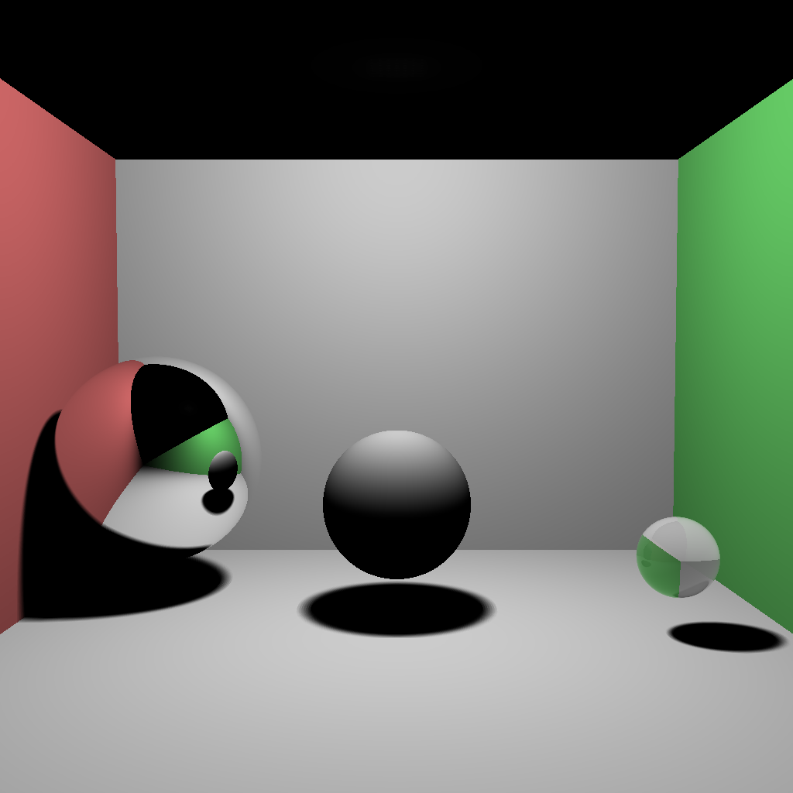
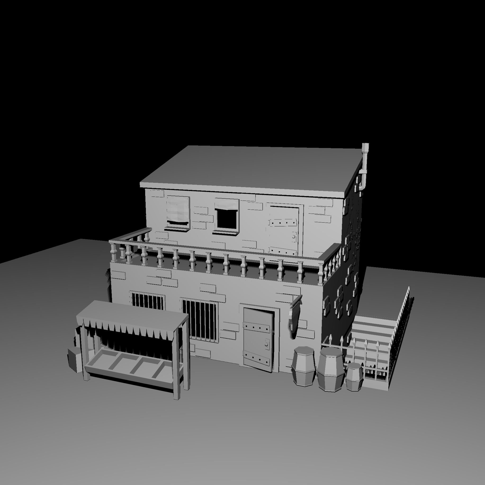

# raytracer

Implementation of an accelerated raytracer using a kd-tree.

Kd-tree optimization only makes sense with a high amount of primitives in the scene.

## Run

- No arguments, changes have to be made in the code `Scene.h`, different types of models are supported through assimp
- Build
- Run `raytracer`

## Setup

### Windows
- Get [vcpkg](https://github.com/Microsoft/vcpkg)
- Run `.\vcpkg.exe install assimp glm sdl2`
- Provide toolchain to cmake `-DCMAKE_TOOLCHAIN_FILE=<path-to-vcpkg>/scripts/buildsystems/vcpkg.cmake`

## Examples

Cornell box scene with 9 primitives and 49 point lights in 1024x1024. 32 seconds with kd-tree vs 9 seconds without.

House scene with 12211 primitives and 4 point lights in 2048x2048. 1 minute with kd-tree vs 40 minutes without.

